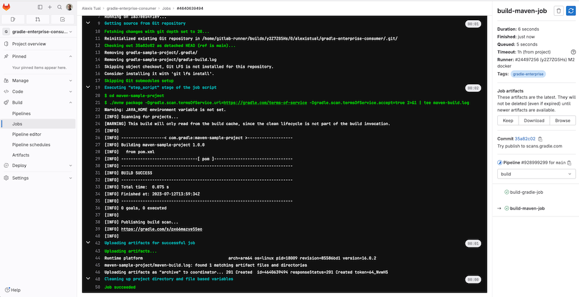
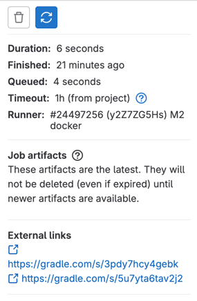

# Develocity GitLab Templates

## Overview
These GitLab templates integrate with Develocity for Gradle and Maven builds run via GitLab. Build scans are available as a free service on [scans.gradle.com](https://scans.gradle.com/) and commercially via [Develocity](https://gradle.com/).



For each Gradle and Maven build that is run from GitLab, these templates exposes the links to the created Build Scan® in the CI job logs.
The templates can also be configured to ad-hoc connect Gradle and Maven builds to an existing Develocity instance such that a Build Scan® is published each time a build is run from GitLab.


## Requirements
> [!IMPORTANT]
> Develocity 2024.1 or above is required starting from version `1.3.0` and above. See [here](#short-lived-access-tokens) for more infos.

- GitLab 15.11 since they use [inputs](https://docs.gitlab.com/ee/ci/yaml/inputs.html).
- Shell with curl should be available on the executor
- Network access to download from Maven central and from GitHub (those URLs can be customized, see [Configuration](#Configuration)

## Configuration
### Gradle Auto-instrumentation
Include the remote template and optionally pass inputs.
To enable Build Scan publishing for Gradle builds, the configuration would look something like presented below (using https://develocity.mycompany.com as an example of Develocity server URL.

```yml
include:
  - remote: 'https://raw.githubusercontent.com/gradle/develocity-gitlab-templates/1.3.3/develocity-gradle.yml'
    inputs:
      url: https://develocity.mycompany.com

build-gradle-job:
  stage: build
  script:
    - !reference [.injectDevelocityForGradle]
    - ./gradlew check -I $DEVELOCITY_INIT_SCRIPT_PATH # Will publish a build scan to https://develocity.mycompany.com
```
The `.injectDevelocityForGradle` creates an init script with the instrumentation logic and exports the path as `$DEVELOCITY_INIT_SCRIPT_PATH` environment variable.
For all other options see `inputs` section in [develocity-gradle.yml](develocity-gradle.yml).

> **_NOTE:_** The build is also instrumented with our [Common Custom User Data Gradle plugin](https://github.com/gradle/common-custom-user-data-gradle-plugin) as well, as it will provide more details about your build.

#### Build Scan links
An optional init script can be used to generate a report containing Build Scan links.
This report can then be [attached](https://docs.gitlab.com/ee/ci/yaml/artifacts_reports.html#artifactsreportsannotations) to the job.
Here's an example:

```yml
include:
  - remote: 'https://raw.githubusercontent.com/gradle/develocity-gitlab-templates/main/develocity-gradle.yml'
    inputs:
      url: https://develocity.mycompany.com

build-gradle-job:
  stage: build
  script:
    - !reference [.injectDevelocityForGradle]
    - ./gradlew clean -I $DEVELOCITY_INIT_SCRIPT_PATH
    - ./gradlew check -I $DEVELOCITY_INIT_SCRIPT_PATH
    # Attach the report
  artifacts:
    !reference [ .build_scan_links_report, artifacts ]
```

This shows the Build Scan links on the job details right panel:



Using GitLab templating, that can be factored and applied to multiple jobs:

```yml
.gradle-inject-job:
  before_script:
    - !reference [ .injectDevelocityForGradle ]
  artifacts:
    !reference [ .build_scan_links_report, artifacts ]

build-gradle-job:
  stage: build
  extends: .gradle-inject-job
  script:
    - ./gradlew build -I $DEVELOCITY_INIT_SCRIPT_PATH

test-gradle-job:
  stage: build
  extends: .gradle-inject-job
  script:
    - ./gradlew test -I $DEVELOCITY_INIT_SCRIPT_PATH
```

Optionally, if you'd like to apply the script to all builds, you may add it to the [`init.d` directory](https://docs.gradle.org/current/userguide/directory_layout.html#dir:gradle_user_home). With this approach, passing the script as `-I` to each build is no longer necessary.

```yml
.gradle-inject-job:
  before_script:
    - !reference [ .injectDevelocityForGradle ]
    - gradle_init_d="${GRADLE_USER_HOME:-~/.gradle}/init.d"
    - mkdir -p "$gradle_init_d" && cp "$DEVELOCITY_INIT_SCRIPT_PATH" "$gradle_init_d"
  artifacts:
    !reference [ .build_scan_links_report, artifacts ]

build-gradle-job:
  stage: build
  extends: .gradle-inject-job
  script:
    - ./gradlew build

test-gradle-job:
  stage: build
  extends: .gradle-inject-job
  script:
    - ./gradlew test
```

### Maven Auto-instrumentation
Include the remote template and optionally pass inputs.
To enable Build Scan publishing for Maven builds, the configuration would look something like presented below (using https://develocity.mycompany.com as an example of Develocity server URL.

```yml
include:
  - remote: 'https://raw.githubusercontent.com/gradle/develocity-gitlab-templates/1.3.3/develocity-maven.yml'
    inputs:
      url: https://develocity.mycompany.com

build-maven-job:
  stage: build
  script:
    - !reference [.injectDevelocityForMaven]
    - ./mvnw clean verify # Will publish a build scan to https://develocity.mycompany.com
```

The `.injectDevelocityForMaven` downloads the extensions and references them in `MAVEN_OPTS`.
For all other options see `inputs` section in [develocity-maven.yml](develocity-maven.yml).

> **_NOTE:_** This instrumentation defines the environment variable `MAVEN_OPTS` taken into account by Maven builds. If `MAVEN_OPTS` is redefined, the instrumentation won't work

> **_NOTE:_** The build is also instrumented with our [Common Custom User Data Maven extension](https://github.com/gradle/common-custom-user-data-maven-extension) as well, as it will provide more details about your build

### Gradle and Maven Auto-instrumentation
If you have both Gradle and Maven builds in a pipeline, you can simply just include both templates:

```yml
include:
  - remote: "https://raw.githubusercontent.com/gradle/develocity-gitlab-templates/1.3.3/develocity-gradle.yml"
    inputs:
      url: https://develocity.mycompany.com
  - remote: "https://raw.githubusercontent.com/gradle/develocity-gitlab-templates/1.3.3/develocity-maven.yml"
    inputs:
      url: https://develocity.mycompany.com

build-maven-job:
  stage: build
  script:
    - !reference [.injectDevelocityForMaven]
    - ./mvnw clean verify # Will publish a build scan to https://develocity.mycompany.com

build-gradle-job:
  stage: build
  script:
    - !reference [.injectDevelocityForGradle]
    - ./gradlew check -I $DEVELOCITY_INIT_SCRIPT_PATH # Will publish a build scan to https://develocity.mycompany.com
```

### Auto-instrumentation compatibility
The following sections list the compatibility of the instrumented Develocity Gradle plugin and Develocity Maven extension with the Develocity version based on the given build tool in use.
#### For Gradle builds
For Gradle builds the version used for the Develocity Gradle plugin can be defined with the `gradlePluginVersion` input. The compatibility of the specified version with Develocity can be found [here](https://docs.gradle.com/enterprise/compatibility/#develocity_gradle_plugin).
For the Common Custom User Data Gradle plugin which is defined with the `ccudPluginVersion` input, you can see the compatibility of the specified version with the Develocity Gradle plugin [here](https://github.com/gradle/common-custom-user-data-gradle-plugin#version-compatibility).

#### For Maven builds
For Maven builds the version used for the Develocity Maven extension can be defined with the `mavenExtensionVersion` input. The compatibility of the specified version with Develocity can be found [here](https://docs.gradle.com/enterprise/maven-extension/#compatibility_with_apache_maven_and_develocity).
For the Common Custom User Data Maven extension which is defined with the `ccudMavenExtensionVersion` input, you can see the compatibility of the specified version with the Develocity Maven extension [here](https://github.com/gradle/common-custom-user-data-maven-extension#version-compatibility).

## Authentication
To authenticate against the Develocity server, you should specify a masked environment variable named `DEVELOCITY_ACCESS_KEY`.
See [here](https://docs.gitlab.com/ee/ci/variables/#define-a-cicd-variable-in-the-ui) on how to do this in GitLab UI.
To generate a Develocity Access Key, you can check [Develocity Gradle plugin docs](https://docs.gradle.com/enterprise/gradle-plugin/#manual_access_key_configuration) and [Develocity Maven extension docs](https://docs.gradle.com/enterprise/maven-extension/#manual_access_key_configuration).

### Short-lived access tokens
Develocity access keys are long-lived, creating risks if they are leaked. To avoid this, users can use short-lived access tokens to authenticate with Develocity. Access tokens can be used wherever an access key would be used. Access tokens are only valid for the Develocity instance that created them.
If a short-lived token fails to be retrieved (for example, if the Develocity server version is lower than `2024.1`), no access key will be set.
In that case, Develocity authenticated operations like build cache read/write and build scan publication will fail without failing the build.
For more information on short-lived tokens, see [Develocity API documentation](https://docs.gradle.com/develocity/api-manual/#short_lived_access_tokens).


## License
This project is available under the [Apache License, Version 2.0](https://github.com/gradle/develocity-gitlab-templates/blob/main/LICENSE).
